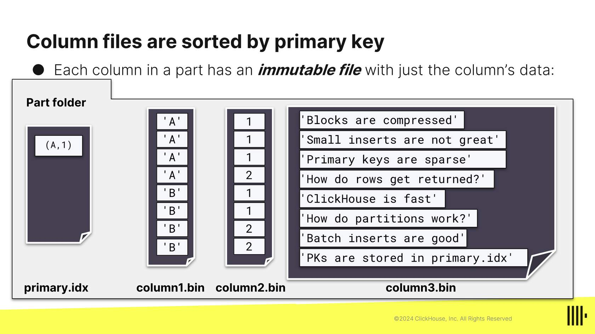
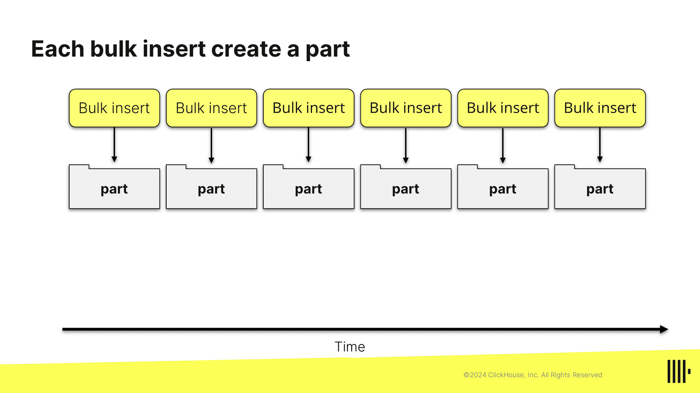
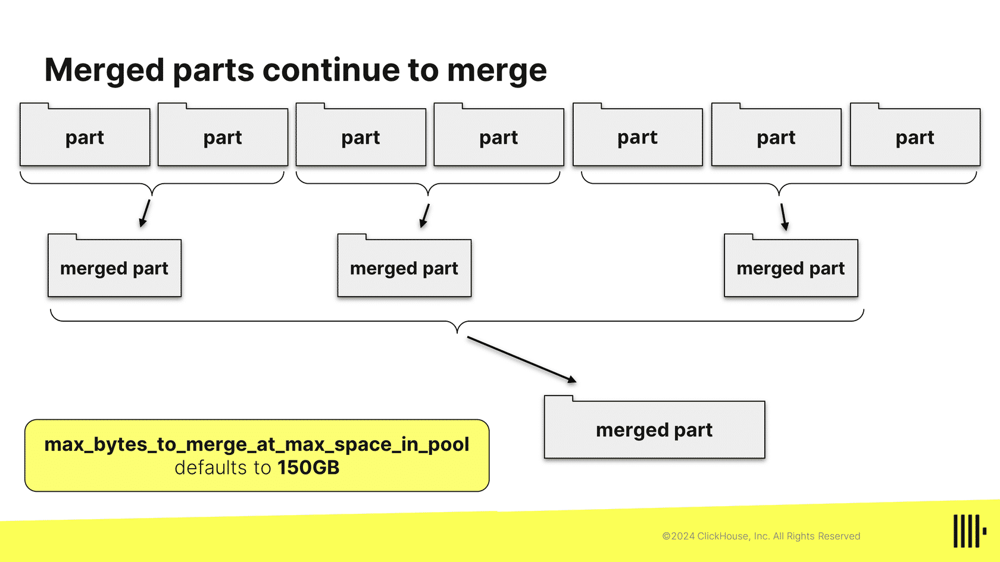
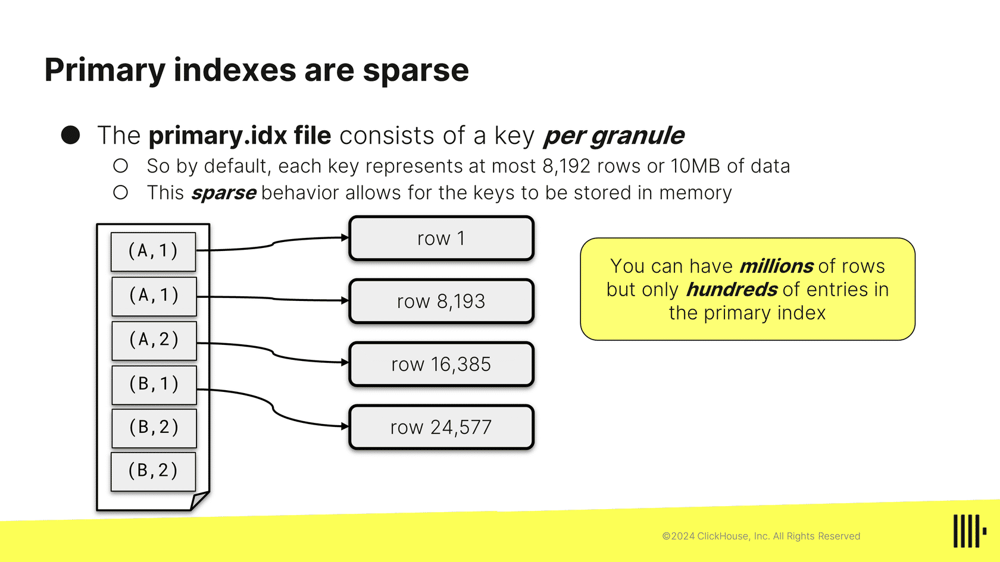

# ClickHouse

ClickHouse is an open-source column-oriented DBMS for online analytical processing (OLAP). It is capable of real-time generation of analytical data reports using SQL queries.

Postgres is an OLTP database, while ClickHouse is an OLAP database. OLTP databases are designed for transactional processing, while OLAP databases are designed for analytical processing.

## Row-Oriented vs. Column-Oriented

In row oriented, data is stored in a row. We have int, bool, string in a row, and we need padding to make sure that all rows have the same size.

In column oriented, data is stored in a column. So the int column is stored together in a file, the bool column is stored together in a file. We can compress it better because the data is similar. The name of the file is the name of the column.

What is the price of phone 102, clickhouse will have to figure out id 102 is the 13th row and return the 13th row from price file. But that's not an analytical question. We are using clickhouse to get avg price of all phones.

## Data format

ClickHouse supports formats like CSV, TSV, and JSON. It also supports custom formats like Avro, ORC, and Parquet. We can get data from S3, databases, Kafka, and other sources.

# Data types

## Nullable

```sql
CREATE TABLE my_table (
    id Int32,  -- If value is not passed it will be 0
    name String,
    age Int32
    metric Nullable(Float64)  -- If value is not passed it will be null, when calculating the average of a column, ClickHouse will ignore NULL values.
) ENGINE = MergeTree()
ORDER BY id;
-- For each nullable column, ClickHouse stores an additional byte per value to indicate whether the value is NULL or not. This will increase the size of the table.
```

## Arrays
```sql
CREATE TABLE my_table (
    id Int32,
    name String,
    tags Array(String)
) ENGINE = MergeTree()
ORDER BY id;

INSERT INTO my_table (id, name, tags) VALUES
(1, 'Alice', ['tag1', 'tag2']),
(2, 'Bob', ['tag3']);
```

## Enum

Clickhouse will internally store the enum as an integer. It will store the string in the dictionary and the integer in the table.

```sql
CREATE TABLE my_table (
    id Int32,
    name String,
    status Enum('active' = 1, 'inactive' = 0)
) ENGINE = MergeTree()
ORDER BY id;
```

## Low cardinality

Useful when you have a column with a small number of distinct values (say 10000). Clickhouse will store values as integers and use a dictionary to map integers to strings.

```sql
CREATE TABLE my_table (
    id Int32,
    name String,
    status LowCardinality(String)
) ENGINE = MergeTree()

INSERT INTO my_table (id, name, status) VALUES
(1, 'Alice', 'active'),
(2, 'Bob', 'inactive');
```

## Other datatypes

- Int8, Int16, Int32, Int64
- UInt8, UInt16, UInt32, UInt64
- Float32, Float64
- Decimal
- Date, DateTime
- UUID

# Primary key

For merge tree engine, the primary key is used to sort the data (it is the same as order by). If we have multiple columns in a primary key, then put the low cardinality column first (ordered by cardinality in ascending order).

```
StudentID   Lastname Firstname  Gender
 101         Smith    John       M
 102         Jones    James      M
 103         Mayo     Ann        F
 104         Jones    George     M
 105         Smith    Suse       F
 Here studentId has the highest cardinality, while gender has the lowest cardinality.
 ```

# MergeTree Architecture

We can have multiple rows with the same primary key.

Inserts should be performed in bulk, we can also use async inserts feature. Each bulk insert creates a part. A part is stored in its own folder, and each part can have millions of rows.







Each data part is divided into granules. Each granule has a min and max primary key value. Each granule can have 8192 rows.

When we query ClickHouse which parts/granules to read based on a primary key. So it is necessary to have primary key in increasing order of cardinality.



In the above example, if we query for (A,2), then ClickHouse will read granule 2 and 3.